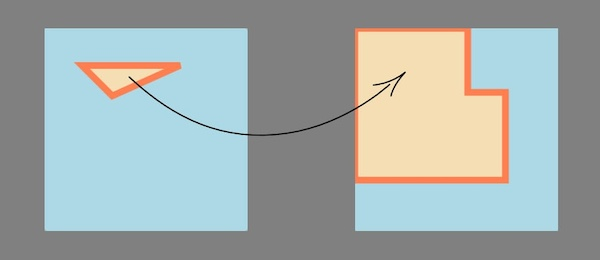

# Тестовое задание "Обмерный план"

## Выполненная демка

[Страница](https://sergeykardashev.github.io/Stworka-walls-to-svg-coordinates/) на gh-pages, куда выгружается полигон, построенный по данным.

Изначально на странице расположен рандомный полигон (треугольник), но после того, как загрузится скрипт, рандомный полигон будет заменен на построенный по точкам из задания.

## Требования

Необходимо из “сырых” данных получить координаты для построения SVG фигур

Имеется массив
Длина, мм Угол, °
1 665 0
947 90
557 0
1 300 90
2 225 180
2 239 270

Напиши скрипт на JS/TS, который по углу и длине стены вычислит координаты вида:
Точка No1 - 0, 0
Точка No2 - 10, 0 и т.д.

**Внимание**
Из-за масштаба при расчёте координат переведи длину стен из мм в см.

Ответ на задание нужно оставить в форме в виде списка координат и ссылки на любую песочницу, например: 0 0 150 0 165 54 0 56 5 89
https://playcode.io/javascript

В задании "Обмерный план" не понятно что считать направлением 0 градусов. Как в математике - вправо? – да
По часовой

Из таблицы всё должно получаться, цифры корректные

Он может не замыкаться на десятые доли

## Уточняющие вопросы.

- Направлением 0 градусов как в математике - вправо? - Да.

- В какую сторону направлен отсчет градусов? - По часовой стрелке.

- Координаты начальной и конечной точки не совпадают. - Он может не замыкаться на десятые доли.

- И если построить многоугольник по цифрам из таблицы, то не получается такой же многоугольник как на картинке, которая под таблицей. Так и задумано?

- Нужно ли как-то обновлять координаты, если они получаются отрицательными? Я имею в виду, нужно ли добавлять поправку координатам всех точек, если одна или несколько точек оказались с отрицательными координатами (за пределами холста)?
